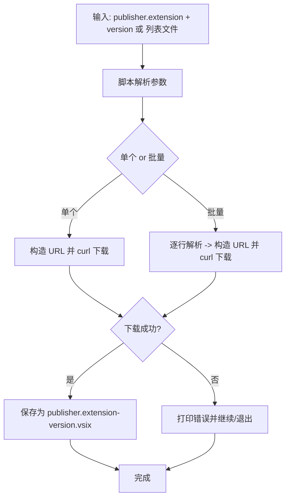

下面给你一个**可直接使用的 bash 脚本**，满足你说的“只需传入版本号就能下载”的需求（脚本需要同时知道要下载的 extension id；我把接口参数设计为 `publisher.extension version`，并支持批量从文件读取）。脚本会构造 Marketplace 官方的 `vspackage` 下载地址并用 `curl` 拉取 `.vsix` 文件。

> 说明：MarketPlace 的官方下载 URL 模板为：
> `https://marketplace.visualstudio.com/_apis/public/gallery/publishers/<PublisherName>/vsextensions/<ExtensionName>/<Version>/vspackage`
> 如果某些扩展需要登录或受限（极少数），此方法可能失败；大多数公开扩展可直接下载。

---

# 问题分析

你想在内网环境手动安装 VS Code 扩展，需把扩展 `.vsix` 从外网下载并打包。Homebrew/Marketplace 页面不便直接抓取文件，但有官方 API 可以按 `publisher/extension/version` 形成 `.vspackage` 下载链接。我们用脚本根据传入的 `publisher.extension` 与 `version` 自动下载并保存为 `*.vsix`。

# 解决方案

提供 `download-vsix.sh` 脚本，支持：

- 单个扩展下载：`./download-vsix.sh GitHub.copilot 1.215.0`
- 批量文件下载（每行格式 `publisher.extension@version`）：`./download-vsix.sh -f list.txt`
- 自动重试、输出保存路径与简单错误信息

# 脚本代码示例

```bash
#!/usr/bin/env bash
# download-vsix.sh
# Usage:
#   ./download-vsix.sh <publisher.extension> <version>
#   ./download-vsix.sh -f list.txt    # list.txt lines: publisher.extension@version
#
# Example:
#   ./download-vsix.sh GitHub.copilot 1.215.0
#   echo "GitHub.copilot@1.215.0" > list.txt
#   ./download-vsix.sh -f list.txt

set -euo pipefail
IFS=$'\n\t'

USER_AGENT="vsix-downloader/1.0 (+https://example.com)"

download_one() {
  local item="$1"   # publisher.extension
  local ver="$2"    # version
  local publisher extension url outname

  # parse publisher.extension (split on first dot)
  if [[ "$item" != *.* ]]; then
    echo "Invalid item name: '$item'. Expect format publisher.extension (e.g. GitHub.copilot)" >&2
    return 1
  fi

  publisher="${item%%.*}"
  extension="${item#*.}"

  outname="${publisher}.${extension}-${ver}.vsix"
  url="https://marketplace.visualstudio.com/_apis/public/gallery/publishers/${publisher}/vsextensions/${extension}/${ver}/vspackage"

  echo "Downloading ${publisher}.${extension} @ ${ver} ..."
  echo "  URL: ${url}"
  # Use curl with follow-redirects, show progress, and fail on HTTP errors
  if curl -fSL --progress-bar -A "$USER_AGENT" -o "${outname}" "${url}"; then
    echo "Saved -> ${outname}"
    return 0
  else
    echo "ERROR: failed to download ${item}@${ver}" >&2
    # remove partial file if exists
    rm -f "${outname}" || true
    return 2
  fi
}

print_usage() {
  cat <<EOF
Usage:
  $0 <publisher.extension> <version>
  $0 -f <file>
Examples:
  $0 GitHub.copilot 1.215.0
  echo "GitHub.copilot@1.215.0" > list.txt
  $0 -f list.txt
File format for -f: each non-empty line must be 'publisher.extension@version' (comments start with #)
EOF
}

# main
if [[ "${#@}" -eq 0 ]]; then
  print_usage
  exit 1
fi

if [[ "$1" == "-f" ]]; then
  if [[ "${#@}" -ne 2 ]]; then
    print_usage
    exit 1
  fi
  file="$2"
  if [[ ! -f "$file" ]]; then
    echo "File not found: $file" >&2
    exit 1
  fi
  while IFS= read -r line || [[ -n "$line" ]]; do
    line="${line%%#*}"   # remove comment
    line="${line//[[:space:]]/}"  # trim whitespace
    [[ -z "$line" ]] && continue
    if [[ "$line" != *@* ]]; then
      echo "Invalid line in $file: '$line'. Expect publisher.extension@version" >&2
      continue
    fi
    item="${line%@*}"
    ver="${line#*@}"
    download_one "$item" "$ver" || echo "Failed: $item@$ver" >&2
  done < "$file"
  exit 0
fi

# single mode
if [[ "${#@}" -ne 2 ]]; then
  print_usage
  exit 1
fi

item="$1"
ver="$2"
download_one "$item" "$ver"
```

把上面保存为 `download-vsix.sh`，然后：

```bash
chmod +x download-vsix.sh
# 单个下载
./download-vsix.sh GitHub.copilot 1.215.0
# 或批量下载
echo "GitHub.copilot@1.215.0" > list.txt
echo "ms-python.python@2025.10.1" >> list.txt
./download-vsix.sh -f list.txt
```

# 流程图



# 注意事项与最佳实践

- **版本号**：必须准确。可以在 Marketplace 页面「Version History」或页面源代码里查看对应版本号。脚本不自动抓取最新版本（如果需要我可以加 `latest` 查询逻辑）。
- **受限扩展**：部分私有或需登录的扩展可能无法通过该公开接口下载；出现 401/403 时需用有权限的账户在浏览器中抓包或通过已登录的机器导出 `.vsix`。
- **网络环境**：请在可以访问 `marketplace.visualstudio.com` 的外网机器上运行脚本，生成 `.vsix` 后拷贝到内网机器安装。
- **校验文件**：你可以在外网机下载后对 `.vsix` 做 `unzip -l file.vsix` 来验证内容，再打包传输。
- **安装**：内网机器安装命令：

  ```bash
  code --install-extension GitHub.copilot-1.215.0.vsix
  ```

  或在 VS Code UI 使用右上 `...` → `Install from VSIX...`。

---

如果你希望我做进一步增强，我可以：

- 加 `latest` 支持（自动查询最新版本并下载）；
- 自动把多个 `.vsix` 打包成一个 `.zip`；
- 在脚本里加入代理支持、并把失败的下载重试若干次；
- 输出一个包含安装命令的脚本（方便内网批量安装）。

你想要哪个增强？
